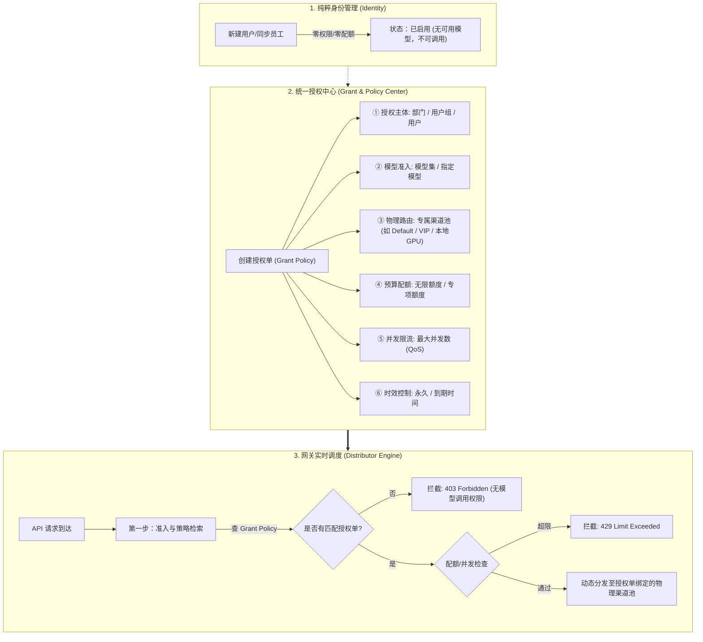

# 企业级【统一授权中心】架构与产品重构方案

## 一、方案背景与目标

### 1.1 现状与用户痛点
* **心智割裂**：在传统架构中，用户的权限散落在不同维度：
  * 「用户管理」：强行配置“路由资源等级”（`user.group`）和“金额/额度（`quota`）”；
  * 「模型集管理」：定义模型集合；
  * 「授权管理」：目前仅负责绑定用户与模型集；
  * 「用户组/模型元数据」：配置并发限制。
* **违背零信任（Least Privilege）原则**：创建用户时被强行要求指定物理渠道组和配额；而在企业内，新建员工应该**默认没有任何权限、没有任何配额（Zero-Privilege by Default）**，所有算力必须通过正式的“授权单”统一发放。

### 1.2 重构目标
将【授权管理】升级为全系统的**唯一且核心的「统一授权与策略中心（Unified Grant & Policy Center）」**：
1. **用户体系回归纯粹身份（Identity Directory）**：
   * 创建用户仅录入基本信息（工号/用户名、姓名、邮箱、部门、密码）。
   * 默认**零特权、零配额、无默认物理通道**，未获得授权前无法调用任何 API。
2. **所有控制全部归拢至【授权管理】**：
   * 在授权管理中，管理员通过**一张授权单**，一次性完成 5 大维度的绑定：
     1. **授权主体（Who）**：部门 / 用户组 / 独立用户；
     2. **模型范围（What Models）**：模型集（Model Sets）或具体指定模型；
     3. **物理渠道池（Where / Routing Tier）**：指定该授权走哪个上游物理渠道池（如默认公网池、企业专线池、本地私有算力池）；
     4. **预算与配额（Budget & Quota）**：无限额度，或分配专项额度预算；
     5. **并发控制（QoS / Concurrency）**：该授权最大并发请求数；
     6. **时效（When / TTL）**：永久有效或项目期限制。

---

## 二、架构设计与核心逻辑



---

## 三、详细设计（五大维度整合）

### 1. 数据模型升级 (`model_grants` & `model_grant_batches`)
在现有授权表基础上扩展，使每个授权单成为自包含的策略实体：

```go
type ModelGrant struct {
    Id          int    `json:"id" gorm:"primaryKey"`
    BatchId     int    `json:"batch_id" gorm:"index"`
    
    // 维度 1: 授权主体 (Who)
    SubjectType int    `json:"subject_type" gorm:"type:int;not null;index"` // 1:部门, 2:用户组, 3:用户
    SubjectId   int    `json:"subject_id" gorm:"type:int;not null;index"`
    
    // 维度 2: 模型范围 (What)
    ModelSetId  int    `json:"model_set_id" gorm:"type:int;not null;index"` // 关联模型集
    
    // 维度 3: 物理渠道/路由资源池 (Where)
    RoutingGroup string `json:"routing_group" gorm:"type:varchar(64);default:''"` // 绑定的渠道池标识(如 "default", "vip", "local_gpu")，留空跟随全局
    
    // 维度 4: 预算与配额 (Budget)
    QuotaType   int    `json:"quota_type" gorm:"type:int;default:0"` // 0: 无限额度, 1: 固定专项额度
    GrantQuota  int64  `json:"grant_quota" gorm:"type:bigint;default:0"` // 授予的总额度
    UsedQuota   int64  `json:"used_quota" gorm:"type:bigint;default:0"`  // 授权单已消耗额度
    
    // 维度 5: 并发控制 (QoS)
    MaxConcurrency int `json:"max_concurrency" gorm:"type:int;default:0"` // 0 为不单独限制
    
    // 维度 6: 时效控制 (When)
    ExpiredAt   int64  `json:"expired_at" gorm:"bigint;default:0"` // 0 为永久
    GrantedBy   int    `json:"granted_by" gorm:"type:int;default:0"`
    CreatedAt   int64  `json:"created_at" gorm:"bigint"`
    UpdatedAt   int64  `json:"updated_at" gorm:"bigint"`
}
```

### 2. 用户管理页面（User Management）改造
* **新建用户抽屉**：
  * **删除/隐藏**：删除必填的“路由资源等级”下拉框；删除初始金额配置。
  * **保留纯粹字段**：用户名、姓名、邮箱、密码、所属组织架构（部门）、备注。
  * **界面提示**：提示“新创建用户默认处于零权限状态，创建完成后请在【授权管理】中为其分配模型与渠道资源”。
* **用户列表与编辑**：
  * “权限设置”区域重构为**只读概览**（展示当前用户继承的所有授权模型数、有效渠道池、已分配总预算）。

### 3. 授权管理页面（Grant Management）改造
升级 `CreateGrantModal`（新建授权单）为清晰的分步或模块化抽屉：
* **模块一【选择对象】**：
  * 组织架构树（勾选部门）、用户组（多选）、单个用户（搜索选择）。
* **模块二【授权模型】**：
  * 现有能力保持并增强：可选已有模型集，或按模型直接多选创建。
* **模块三【资源通道与路由】（NEW）**：
  * 下拉选择上游渠道池（例如：`default (默认共享池)`、`vip (生产专线池)`、`deepseek-local (机房本地集群)`）。
* **模块四【配额与并发控制】（NEW）**：
  * **额度预算**：单选【不限额度】或【指定专项预算金额（如 $100）】。
  * **并发限制**：输入最大并发数（0 为不限）。
* **模块五【有效期】**：
  * 永久有效，或指定到期时间。

### 4. 网关分发调度（Distributor Runtime）联动
1. **策略命中**：
   * 用户发起请求 `POST /v1/chat/completions` 请求模型 `gpt-4o`。
   * 网关通过用户的授权单（用户直属、或所在部门/用户组），检索命中的有效 Grant 记录。
2. **多维检查**：
   * 检查是否过期；
   * 检查授权单额度（若配置了固定额度，扣减并校验是否充足）；
   * 检查授权单并发（若配置了并发上限，进入 Redis 原子并发限流器）。
3. **动态物理渠道路由**：
   * **彻底解绑 `user.group`**：调度引擎直接使用授权单上配置的 `RoutingGroup`，到对应的渠道池中做健康负载均衡分发！
   * 优势：同一个用户，调用 `gpt-4o` 走 `vip` 专线渠道池；调用 `qwen-2.5` 走 `local_gpu` 机房本地算力池，完全由授权单灵活定义。

---

## 四、演进与兼容性保障

1. **数据库平滑迁移**：
   * `ALTER TABLE model_grants ADD COLUMN ...`，默认值均为安全回退值（`routing_group = ''`, `quota_type = 0` 不限额），老数据自动保持现有行为。
2. **向后兼容**：
   * 若某个授权单未指定 `routing_group`，系统自动回退至全局 `default` 渠道池，老配置平滑过渡，不产生线上中断。

---

## 五、方案优势总结

| 对比维度 | 传统模式（改造前） | 统一授权中心（新方案） |
| :--- | :--- | :--- |
| **用户创建** | 必须纠结选什么 Group、配什么金额，概念混杂 | 纯粹录入人员身份，秒级建号，符合零信任 |
| **管理入口** | 在用户列表调金额、在用户组调并发、在授权管理配模型 | **一站式在【授权管理】搞定所有权限、渠道、配额与并发** |
| **路由灵活性** | 一个用户全局只能有一个 Group，所有模型只能走这一个组 | **细粒度按授权单绑定渠道池**，不同模型可走不同物理池 |
| **企业安全** | 默认有权限易导致非预期调用 | 严格**默认零权限**，每一笔算力消耗都有据可查 |
