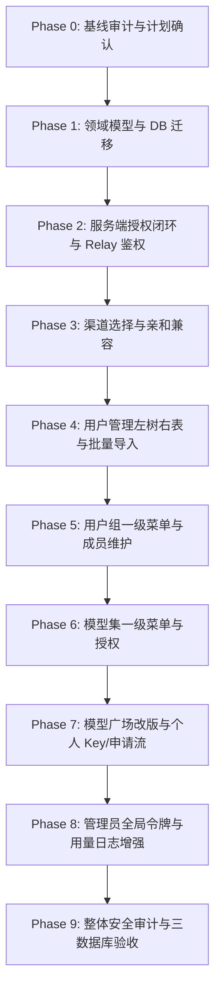

# 企业内部模型访问平台 — Phase 0 基线确认与差距审计报告及实施计划

> **基线分支**：`codex/latest-backend-classic`  
> **工作区状态**：工作目录 clean，无未提交冲突  
> **设计原则**：单租户企业形态（多租户产品设计延期）、部门与用户组分离、模型与模型集分离、API Key 权限收窄、Classic 风格延续、严格三数据库（SQLite/MySQL/PostgreSQL）兼容与 Relaykit 独立构建

---

## 1. Phase 0：基线确认与审计总结

### 1.1 环境与代码基线确认

| 检查项 | 当前代码现状 | 结论 |
| --- | --- | --- |
| **工作目录与分支** | 当前处于 `/Users/zevin/Desktop/fit2cloud/code/new-api`，分支为 `codex/latest-backend-classic`。 | ✅ 通过 |
| **工作区变更** | 执行 `git status` 确认 working tree clean。 | ✅ 通过 |
| **后端独立构建** | `go build .` 构建成功；`cd relaykit && GOWORK=off go build ./...` 独立构建成功。 | ✅ 通过 |
| **Classic 前端构建** | `cd web/classic && bun run build` 构建成功（Rsbuild + React 19 + Semi UI + Tailwind）。 | ✅ 通过 |
| **受保护标识** | 严格遵守 `AGENTS.md`，不修改 `new-api` 与 `QuantumNous` 品牌与归属。 | ✅ 遵守 |

---

### 1.2 现状与目标差距审计表 (Gap Analysis)

#### (1) 领域模型与数据库层 (`model/`)

| 领域对象 | 现状 | 目标与差距 | 实施计划 |
| --- | --- | --- | --- |
| **部门 (`Department`)** | ❌ 未实现 | 需要支持组织树形层级、`parent_id`、`path`、部门名称及主管/管理范围。 | Phase 1 新增 `model/department.go` |
| **用户组 (`UserGroup`)** | ❌ 未实现 (仅有兼容用的 `User.Group` 字符串) | 独立实体，包含组名、描述、状态、创建人等；需关联模型集与成员。 | Phase 1 新增 `model/user_group.go` |
| **用户组成员 (`UserGroupMember`)** | ❌ 未实现 | 关联表（`user_id`, `group_id`），支持一个用户加入多个组。 | Phase 1 新增 `model/user_group_member.go` |
| **模型集 (`ModelSet`)** | ❌ 未实现 | 授权逻辑容器，包含名称、描述、状态、关联模型数、配额策略摘要。 | Phase 1 新增 `model/model_set.go` |
| **模型集项 (`ModelSetItem`)** | ❌ 未实现 | 关联表（`model_set_id`, `model_name` 或 `model_id`），支持多对多。 | Phase 1 新增 `model/model_set_item.go` |
| **模型授权 (`ModelGrant`)** | ❌ 未实现 | 记录主体（部门/用户组/用户）到模型集的授权关系、有效期、授权人。 | Phase 1 新增 `model/model_grant.go` |
| **模型权限申请 (`ModelAccessRequest`)**| ❌ 未实现 | 申请单流转（待审批、已批准、已拒绝、已撤销），审批意见与有效期。 | Phase 1 新增 `model/model_access_request.go` |
| **授权与操作审计 (`ModelAuthAudit`)** | ❌ 未实现 | 记录授权授予/回收、审批、成员变更等审计流。 | Phase 1 新增 `model/model_auth_audit.go` |
| **用户模型 (`User`)** | ⚠️ 已有基础用户表 | 需扩展关联字段：`department_id`、`employee_id`（工号）等。 | Phase 1 扩展 `model/user.go` |
| **令牌模型 (`Token`)** | ⚠️ 已有 `ModelLimits` 字符串 | 需与用户有效模型权限取交集；校验仅能收窄不可扩大。 | Phase 2 改造 `model/token.go` |

#### (2) 服务端授权与请求链路 (`service/`, `middleware/`, `relay/`)

| 模块 | 现状 | 目标与差距 | 实施计划 |
| --- | --- | --- | --- |
| **用户有效模型计算** | ❌ 仅根据 `User.Group` 判断 | 计算 `Department.Grants ∪ UserGroup.Grants ∪ User.Grants`，并带短缓存与即时失效。 | Phase 2 实现 `service/model_auth.go` |
| **API Key 权限收窄** | ⚠️ 仅检查 `Token.ModelLimits` | `EffectiveModels = UserGrantedModels ∩ TokenModelLimits`，无权限或越权直接 403。 | Phase 2 拦截器闭环 |
| **Relay 请求鉴权** | ⚠️ 在 `middleware/distributor.go` 进行初步检查 | 在选路和亲和之前，强制做有效模型授权校验；覆盖流式、重试、Playground、Task。 | Phase 2 改造中间件 |
| **渠道亲和兼容** | ⚠️ `service.GetPreferredChannelByAffinity` 直接运行 | 亲和命中后重新验证目标模型是否在请求有效授权范围内，清理过期不合法的亲和缓存。 | Phase 3 优化渠道亲和逻辑 |

#### (3) 管理员端 Classic 前端 (`web/classic/`)

| 模块/页面 | 现状 | 目标与差距 | 实施计划 |
| --- | --- | --- | --- |
| **侧边栏导航 (`SiderBar.jsx`)** | 包含渠道、模型、用户、系统设置等 | 新增一级菜单：“用户组 (`/console/user-groups`)”、“模型集 (`/console/model-sets`)”；普通用户隐藏“令牌管理”。 | Phase 5, Phase 6, Phase 7 |
| **用户管理 (`/console/user`)** | 纯表格列表 | 重构为“左侧部门树 + 右侧用户列表”布局；增加工号/部门/用户组多重筛选；新增用户详情 SideSheet；新增 CSV/Excel 批量导入预检与报告。 | Phase 4 |
| **用户组管理 (`/console/user-groups`)** | ❌ 无页面 | 新增用户组 CRUD、成员穿梭维护、模型集授权与有效期设置、删除引用保护。 | Phase 5 |
| **模型集管理 (`/console/model-sets`)** | ❌ 无页面 | 新增模型集 CRUD、关联模型选择、授权部门/用户组/用户展示、删除引用保护。 | Phase 6 |
| **管理员令牌管理 (`/console/token`)** | 所有人可访问的个人令牌管理 | 改造为管理员全局 Key 管理，增加用户/部门/用户组/模型筛选；从用户详情携带 `user_id` 跳转；密钥仅创建/轮换展示一次。 | Phase 8 |

#### (4) 普通用户端 Classic 前端 (`web/classic/`)

| 模块/页面 | 现状 | 目标与差距 | 实施计划 |
| --- | --- | --- | --- |
| **模型广场 (`/pricing`)** | 仅展示模型价格/倍率与说明卡片 | 升级为“全部模型 / 我的申请 / 我的 API Key”三位一体控制台；卡片展示用户权限状态（未授权/审批中/已授权/已过期）与动作按钮。 | Phase 7 |
| **个人 API Key 管理** | 原在 `/console/token` | 迁移/嵌入模型广场“我的 API Key”子页，创建 Key 时仅可勾选已授权模型；普通用户访问旧 `/console/token` 自动重定向。 | Phase 7 |
| **权限申请流程** | ❌ 无流程 | 用户可在模型广场直接提交模型或模型集申请；支持查看申请记录与审批反馈。 | Phase 7 |

---

## 2. 详细接口与路由设计清单

### 2.1 后端 API 路由清单 (RESTful)

```go
// 部门管理 (Admin)
GET    /api/department/tree              // 获取部门树
GET    /api/department/:id               // 部门详情
POST   /api/department                   // 创建部门
PUT    /api/department                   // 更新部门
DELETE /api/department/:id               // 删除部门（引用保护）

// 用户组管理 (Admin)
GET    /api/user-group                   // 分页查询用户组列表
GET    /api/user-group/:id               // 用户组详情及成员/授权
POST   /api/user-group                   // 创建用户组
PUT    /api/user-group                   // 更新用户组
DELETE /api/user-group/:id               // 删除用户组
GET    /api/user-group/:id/members       // 获取成员列表
POST   /api/user-group/:id/members       // 批量添加成员
DELETE /api/user-group/:id/members       // 批量移除成员

// 模型集管理 (Admin)
GET    /api/model-set                    // 分页查询模型集列表
GET    /api/model-set/:id                // 模型集详情（包含模型、授权对象）
POST   /api/model-set                    // 创建模型集
PUT    /api/model-set                    // 更新模型集
DELETE /api/model-set/:id                // 删除模型集（引用保护）

// 模型授权管理 (Admin)
GET    /api/model-grant                  // 查询授权列表（支持按主体/模型集）
POST   /api/model-grant                  // 授予模型集权限 (部门/用户组/用户)
DELETE /api/model-grant/:id              // 撤销授权

// 权限申请与审批
POST   /api/model-access-request         // 普通用户提交申请
GET    /api/model-access-request/my      // 普通用户查询我的申请记录
GET    /api/model-access-request         // 管理员查询待审批/历史申请
POST   /api/model-access-request/:id/approve // 管理员审批通过
POST   /api/model-access-request/:id/reject  // 管理员审批拒绝

// 用户导入与批量操作 (Admin)
POST   /api/user/import/preview          // CSV/Excel 上传预检
POST   /api/user/import/execute          // 确认执行导入
POST   /api/user/batch/group             // 批量加入/移出用户组

// 普通用户模型广场与个人授权查询
GET    /api/user/my/model-permissions    // 获取当前用户所有有效模型列表及状态
```

---

## 3. 分阶段实施路线图



### 执行原则
1. **严格分阶段**：每一阶段完成后，先进行单元测试、三数据库验证（SQLite/MySQL/PostgreSQL）、前端构建与浏览器测试，再进入下一阶段。
2. **零破坏性**：老字段兼容，已有 API Key 与渠道不受影响。
3. **i18n 完整覆盖**：所有新增 UI 文本严格录入各语言 locale 文件。

---

## 4. 验证计划

### 4.1 自动化测试 (Backend)
- `go test -v ./model/...`：验证 GORM 迁移、跨数据库兼容（SQLite/MySQL/PG）、软删除与级联引用保护。
- `go test -v ./service/...`：验证用户有效模型集合并、交集计算、缓存失效。
- `go test -v ./middleware/...`：验证无权限 403 拦截、API Key 范围越权拦截、Playground 与异步任务拦截。
- `cd relaykit && GOWORK=off go build ./...`：验证 relaykit 独立构建无污染。

### 4.2 前端验证 (Frontend & Browser)
- `bun run build`：确保 Rsbuild 生产构建通过。
- 浏览器真实交互验证：
  1. 普通用户登录：侧边栏无独立令牌管理；进入模型广场，展示“全部模型/我的申请/我的 API Key”。
  2. 申请模型权限 -> 管理员审批 -> 授权即时生效。
  3. 创建 API Key，仅可选择已授权模型；调用 Relay API 验证 200 / 403 权限边界。
  4. 管理员用户管理：左侧部门树切换、右侧用户筛选、批量导入 CSV 预检与执行。
